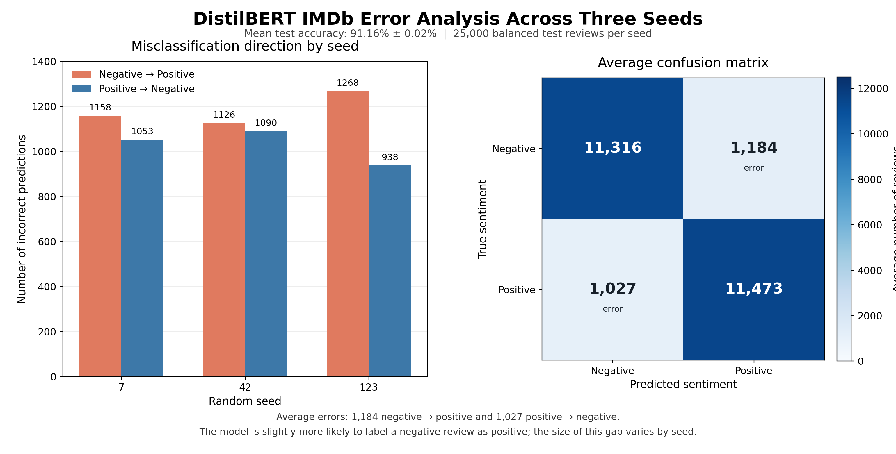

# DistilBERT IMDb Sentiment Classifier

An end-to-end NLP project that fine-tunes
[`distilbert-base-uncased`](https://huggingface.co/distilbert/distilbert-base-uncased)
to classify IMDb movie reviews as **negative** or **positive**. The repository
includes reproducible training, validation-based checkpoint selection,
three-seed evaluation, error analysis, command-line inference, a Slurm batch
script, and a private Gradio interface.

## Results

| Seed | Best validation accuracy | Test accuracy | Test F1 |
| ---: | ---: | ---: | ---: |
| 7 | 90.94% | 91.16% | 91.19% |
| 42 | 91.44% | 91.14% | 91.15% |
| 123 | 91.38% | 91.18% | 91.29% |
| **Mean ± sample SD** | - | **91.16% ± 0.02%** | **91.21% ± 0.07%** |

The low variation across seeds indicates that the result is stable under these
settings. Raw aggregate values are available in
[`results/three_seed_metrics.csv`](results/three_seed_metrics.csv).



## Data workflow

The project uses the
[`stanfordnlp/imdb`](https://huggingface.co/datasets/stanfordnlp/imdb)
dataset from Hugging Face.

| Split | Examples | Purpose |
| --- | ---: | --- |
| Training | 20,000 | Update model parameters |
| Validation | 5,000 | Select the best checkpoint |
| Test | 25,000 | Final evaluation after training |
| Unsupervised | 50,000 | Not used |

The official 25,000-example training split is divided into training and
validation sets with fixed split seed `2026`. The official test split remains
separate from training and validation.

## Training configuration

| Setting | Value |
| --- | --- |
| Base model | `distilbert/distilbert-base-uncased` |
| Parameters | 66,955,010 |
| Maximum length | 256 tokens |
| Epochs | 2 |
| Training / evaluation batch size | 32 / 64 |
| Learning rate | `2e-5` |
| Weight decay | `0.01` |
| Warmup | 10% of training steps |
| Optimizer / scheduler | AdamW / linear decay |
| Precision | FP16 |
| Model-selection metric | Validation accuracy |

The reported experiments used Python 3.10, PyTorch 2.5.1 with CUDA 12.1,
Transformers 5.17.0, and an NVIDIA RTX A5000. Peak allocated GPU memory was
approximately 2.5 GiB.

## Repository structure

```text
.
├── train_distilbert.py             # Fine-tuning and final evaluation
├── predict_sentiment.py            # CLI and interactive inference
├── analyze_distilbert_errors.py    # Detailed qualitative error analysis
├── gradio_sentiment_app.py         # Private browser interface
├── distilbert_imdb.sbatch          # Portable Slurm GPU job
├── project_config.py               # Repo-relative paths and cache settings
├── requirements.txt                # Direct reproducibility dependencies
├── requirements-full.txt           # Full environment snapshot
└── results/                         # Small, shareable aggregate results
```

Datasets, caches, model weights, checkpoints, logs, and raw review excerpts are
excluded from Git because they are large, generated, or unsuitable for a public
source repository.

## Setup

Clone the repository and create an isolated environment:

```bash
git clone https://github.com/YOUR_USERNAME/distilbert-imdb-sentiment-classifier.git
cd distilbert-imdb-sentiment-classifier

python -m venv .venv
source .venv/bin/activate
python -m pip install --upgrade pip
python -m pip install -r requirements.txt
```

On Windows PowerShell, activate the environment with:

```powershell
.\.venv\Scripts\Activate.ps1
```

`requirements.txt` uses the official PyTorch CUDA 12.1 wheel index. CPU-only
users should install the appropriate PyTorch build for their system before
installing the remaining packages.

By default, the Hugging Face cache is stored under
`.cache/huggingface/`. Paths can be changed with `DISTILBERT_PROJECT_DIR`,
`HF_HOME`, `HF_DATASETS_CACHE`, and `HF_HUB_CACHE`.

## Train locally on a GPU

```bash
python train_distilbert.py \
    --seed 42 \
    --epochs 2 \
    --train-batch-size 32 \
    --eval-batch-size 64 \
    --max-length 256 \
    --learning-rate 2e-5 \
    --weight-decay 0.01 \
    --num-workers 4 \
    --patience 2
```

Outputs are written to `runs/seed_42/`. The training script intentionally
requires CUDA; inference can run on either CPU or CUDA.

## Submit with Slurm

Create the log directory before submission and provide the account and GPU
partition used by your cluster:

```bash
mkdir -p logs

PYTHON_BIN="$(command -v python)" sbatch \
    --account=YOUR_ACCOUNT \
    --partition=YOUR_GPU_PARTITION \
    distilbert_imdb.sbatch 42 2 4
```

The positional arguments are the random seed, maximum epochs, and DataLoader
worker count. If needed, add a site-specific option such as
`--nodelist=YOUR_GPU_NODE` at submission time rather than editing the script.

## Run inference

Train the seed-42 model first, then classify one or more reviews:

```bash
python predict_sentiment.py \
    --text "This movie was wonderful and beautifully acted." \
    --text "The story was boring and the acting was terrible."
```

Without `--text`, the command starts an interactive prompt. Use `--device cpu`
or `--device cuda` to select the inference device explicitly.

## Error analysis

Generate balanced examples of negative-to-positive and positive-to-negative
mistakes, including borderline, random, and high-confidence errors:

```bash
python analyze_distilbert_errors.py \
    --seed 42 \
    --batch-size 64 \
    --num-workers 4 \
    --examples-per-group 4
```

Across the three runs, the average confusion matrix was:

| True class | Predicted negative | Predicted positive |
| --- | ---: | ---: |
| Negative | 11,316 | 1,184 |
| Positive | 1,027 | 11,473 |

Qualitative inspection found difficult cases involving mixed sentiment,
sarcasm, neutral or plot-heavy language, apparent label noise, and long reviews
whose final opinion could fall beyond the 256-token limit. These are observed
patterns rather than proof of a single cause for each error.

## Launch the Gradio interface

```bash
python gradio_sentiment_app.py \
    --device auto \
    --host 127.0.0.1 \
    --port 7860
```

Open <http://127.0.0.1:7860>. For a remote compute node, keep public sharing
disabled and use an SSH tunnel appropriate for your system, for example:

```bash
ssh -N -L 7860:COMPUTE_NODE:7860 USER@LOGIN_HOST
```

The interface reports the predicted label, class probabilities, token count,
truncation status, and inference device. Confidence is a model probability
estimate, not a guarantee of correctness.

## Reproducibility notes

- Every run uses a separate output directory identified by seed.
- The best checkpoint is selected only with validation accuracy.
- The test split is evaluated after checkpoint selection.
- The repository records aggregate results but intentionally excludes trained
  weights; rerun training to recreate them.
- Results can vary with hardware, CUDA kernels, and dependency versions even
  when random seeds are fixed.

## Limitations

This is a binary English movie-review classifier trained on IMDb. It does not
represent neutral sentiment, should not be treated as a general-purpose emotion
model, and may inherit biases or annotation errors present in its training data.
